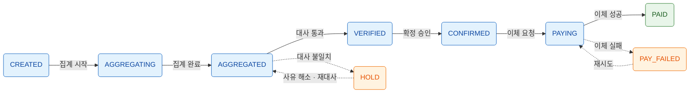

## 1. 개요
- 정산(Settlement): 거래로 발생한 금전 흐름을 집계·계산·확정하여 이해관계자(판매자, 파트너, PG사 등)에게 지급할 금액을 산출하고 실제 지급까지 완료하는 일련의 프로세스
- 정산 시스템의 목적
	- 거래 데이터 기반의 정확한 지급 금액 산출
	- 금액 불일치(누락, 중복, 오차)의 사전 탐지 및 차단
	- 지급 이력의 완전한 추적 가능성(Auditability) 확보
	- 세무·회계·법적 요건 충족
- 정산 시스템의 3대 핵심 가치

| 가치                 | 의미                  | 실패 시 리스크                |
| ------------------ | ------------------- | ----------------------- |
| 정확성 (Accuracy)     | 1원 단위까지 맞는 금액 계산    | 금전 손실, 파트너 신뢰 하락, 법적 분쟁 |
| 완전성 (Completeness) | 모든 거래가 누락 없이 정산에 포함 | 미지급/과지급, 회계 감사 실패       |
| 추적성 (Traceability) | 모든 금액의 근거 거래 역추적 가능 | CS 대응 불가, 감사 대응 불가      |

## 2. 핵심 용어 정의
| 용어 | 영문 | 정의 |
| --- | --- | --- |
| 정산 대상 | Settlement Target | 정산금을 지급받는 주체 (판매자, 입점사, 파트너 등) |
| 정산 기준일 | Settlement Base Date | 거래를 정산 대상 기간에 귀속시키는 기준 시점 (결제일, 구매확정일 등) |
| 정산 주기 | Settlement Cycle | 정산을 수행하는 반복 주기 (D+N, 주정산, 월정산 등) |
| 정산 집계 | Aggregation | 기간 내 거래 건들을 정산 대상별로 합산하는 작업 |
| 정산 확정 | Confirmation | 집계·계산된 금액을 변경 불가 상태로 고정하는 행위 |
| 지급 | Payout / Disbursement | 확정된 정산금을 실제 계좌로 이체하는 행위 |
| 대사 | Reconciliation | 서로 다른 원천의 데이터(내부 거래 vs PG 거래내역 등)를 비교·검증하는 작업 |
| 원장 | Ledger | 모든 금전 변동을 기록하는 불변(Immutable) 장부 |
| 보류 | Hold | 이상 거래·심사 등의 사유로 지급을 일시 중지하는 상태 |
| 이월 | Carry-over | 마이너스 정산금 등을 다음 정산 회차로 넘기는 처리 |
| 역정산 | Reverse Settlement | 이미 정산된 거래의 취소/환불 발생 시 금액을 차감·회수하는 처리 |
| 원천징수 | Withholding Tax | 지급자가 소득자의 세금을 미리 공제하여 대신 납부하는 제도 |

## 3. 정산 프로세스 전체 흐름
### 3.1 단계별 프로세스
| 단계 | 명칭 | 수행 내용 | 산출물 |
| --- | --- | --- | --- |
| 1 | 거래 수집 | 결제/취소/환불 등 정산 원천 데이터 적재 | 정산 원장 데이터 |
| 2 | 정산 대상 선별 | 정산 기준일·상태 조건 충족 거래 추출 | 정산 대상 거래 목록 |
| 3 | 금액 계산 | 수수료·공제·세금 반영한 건별 정산금 산출 | 건별 정산 내역 |
| 4 | 집계 | 정산 대상별·주기별 합산 | 정산 대상별 집계본 |
| 5 | 대사 | 내부 데이터 vs 외부 데이터(PG 등) 검증 | 대사 결과 리포트 |
| 6 | 확정 | 검증 완료된 정산 금액 확정 (이후 수정 불가) | 정산 확정본 |
| 7 | 지급 | 계좌 이체 실행 및 결과 수신 | 지급 완료 내역 |
| 8 | 사후 처리 | 지급 실패 재처리, 정산서 발행, 세무 신고 데이터 생성 | 정산서, 세무 자료 |

### 3.2 상태 전이 (정산 회차 기준)

- 다이어그램 범례
	- 실선: 정상 흐름 (파랑), 최종 완료 상태는 초록
	- 점선: 예외 흐름 (주황) — 예외 상태는 메인 라인 아래 배치
- HOLD 복귀 경로: 사유 해소 시 재대사를 거쳐 통과해야 VERIFIED로 전이 (HOLD → AGGREGATED → VERIFIED)

- 상태 전이 원칙
	- 모든 상태 변경은 이력 테이블에 기록할 것
	- CONFIRMED 이후 금액 수정은 금지하며, 오류 발견 시 다음 회차에서 조정 항목으로 반영할 것
	- 역방향 전이(PAID → CONFIRMED 등)는 허용하지 않을 것

## 4. 정산 기준일과 정산 주기
### 4.1 정산 기준일 선택지
| 기준 | 설명 | 장점 | 단점 |
| --- | --- | --- | --- |
| 결제 완료일 | 결제 승인 시점 기준 귀속 | 단순, 예측 가능 | 취소/환불 시 역정산 다수 발생 |
| 구매 확정일 | 구매 확정(또는 자동 확정) 시점 기준 | 환불 리스크 최소화 | 정산 지연으로 파트너 불만 가능 |
| 배송 완료일 | 배송 완료 시점 기준 | 이커머스 관행에 부합 | 배송 데이터 의존성 발생 |
| 서비스 제공일 | 용역 제공 완료 시점 기준 | 회계 수익 인식 기준과 일치 | 시점 판정 로직 복잡 |

- 권장 사항
	- 실물 커머스는 구매 확정일 기준을 권장함 (환불로 인한 역정산 최소화)
	- 기준일과 무관하게 원천 이벤트(결제/취소) 발생 시각은 별도 보존할 것

### 4.2 정산 주기 유형
| 주기 | 설명 | 적합 상황 |
| --- | --- | --- |
| D+N 일정산 | 거래일 기준 N영업일 후 지급 (예: D+2) | 빠른 지급이 경쟁력인 플랫폼 |
| 주정산 | 주 단위 마감 후 지급 (예: 월~일 거래 → 익주 수요일 지급) | 일반적인 마켓플레이스 |
| 월정산 | 월 단위 마감 후 익월 지급 (예: 익월 10일) | B2B, 광고, 제휴 정산 |
| 구매확정 즉시 | 구매 확정 시 개별 지급 | 고액·저빈도 거래 |

- 설계 시 고려 사항
	- 영업일 계산 로직 필요 (주말·공휴일 처리, 공휴일 캘린더 관리 주체 결정)
	- 정산 대상별로 상이한 주기 적용 가능하도록 설계할 것 (파트너 등급별 차등 등)
	- 마감 시각(Cut-off) 명확화 필수 (예: 매일 00:00 기준, 타임존 명시)

## 5. 정산 금액 계산
### 5.1 기본 계산 구조
- 기본 산식: `정산금 = 거래 금액 - 플랫폼 수수료 - 결제 수수료(PG) - 기타 공제 + 조정 금액`
- 계산 순서와 반올림 정책을 명문화하고 전 시스템에서 단일 규칙으로 통일할 것

| 구성 요소 | 방향 | 예시 |
| --- | --- | --- |
| 거래 금액 | (+) | 상품 판매가 × 수량 |
| 할인 부담금 | (±) | 플랫폼 부담 쿠폰은 가산, 판매자 부담 쿠폰은 차감 |
| 플랫폼 수수료 | (-) | 판매가의 10% |
| PG 결제 수수료 | (-) | 결제액의 2.5% (부담 주체 정책에 따름) |
| 배송비 | (±) | 판매자 수취 배송비는 가산 |
| 프로모션 분담금 | (-) | 판매자 분담 프로모션 비용 |
| 원천징수세 | (-) | 개인 사업자/프리랜서 대상 3.3% |
| 조정 금액 | (±) | 전 회차 오류 보정, 페널티, 이월 금액 |

### 5.2 수수료 정책 설계
| 항목 | 설계 포인트 |
| --- | --- |
| 수수료 유형 | 정률(%), 정액(원), 정률+정액 혼합, 구간별(Tiered) 지원 여부 결정 |
| 적용 단위 | 카테고리별, 판매자별, 상품별, 프로모션별 차등 적용 가능 구조 필요 |
| 이력 관리 | 수수료율 변경 시 적용 시작일 기반 버저닝 필수 (과거 거래는 당시 요율로 계산) |
| 계산 시점 | 거래 발생 시점에 요율을 스냅샷으로 고정 저장할 것 (정산 시점 재조회 금지) |
| 최소/최대 | 건별 최소 수수료, 상한 수수료 정책 지원 여부 결정 |

### 5.3 금액 처리 원칙
- 모든 금액은 정수(원 단위) 또는 Decimal 타입으로 처리할 것 (부동소수점 Float/Double 사용 절대 금지)
- 반올림 정책(절사/반올림/절상)을 항목별로 정의하고 문서화할 것
- 부가세(VAT) 처리 방식 결정 필수

| 구분 | 설명 |
| --- | --- |
| 내부 계산 | 공급가액과 부가세 분리 보관 (세금계산서 발행 근거) |
| 수수료 부가세 | 플랫폼 수수료에 대한 부가세 10% 별도 청구 여부 명확화 |
| 원 단위 배분 | 부가세 계산 시 발생하는 끝전(1원 오차)의 귀속 규칙 정의 |

### 5.4 원천징수 (개인/프리랜서 지급 시)
| 항목 | 내용 |
| --- | --- |
| 대상 | 사업소득자(개인), 기타소득자에게 지급하는 경우 |
| 세율 | 사업소득 3.3% (소득세 3% + 지방소득세 0.3%), 기타소득 8.8% |
| 처리 | 지급액에서 공제 후 회사가 익월 10일까지 신고·납부 |
| 시스템 요건 | 정산 대상의 사업자 유형(법인/개인사업자/개인) 관리 및 유형별 세금 계산 분기 |

## 6. 대사 (Reconciliation)
### 6.1 대사의 종류
| 대사 유형 | 비교 대상 A | 비교 대상 B | 목적 |
| --- | --- | --- | --- |
| 거래 대사 | 내부 주문/결제 데이터 | PG사 거래 내역 | 결제 누락·중복·금액 불일치 탐지 |
| 입금 대사 | PG 정산 예정 금액 | 실제 은행 입금액 | PG → 자사 입금 검증 |
| 정산 대사 | 건별 정산 내역 합계 | 정산 집계본 | 내부 계산 정합성 검증 |
| 지급 대사 | 지급 요청 금액 | 은행 이체 결과 | 이체 실패·부분 실패 탐지 |
| 잔액 대사 | 원장 잔액 | 실제 계좌 잔액 | 전체 자금 흐름 검증 |

### 6.2 대사 프로세스 설계
- PG사 거래 내역 파일(EDI, API)의 수신 스케줄과 포맷 파싱 모듈 구축 필요
- 대사 키 설계: 주문번호 + PG 거래번호 + 승인번호 조합으로 매칭
- 불일치 유형별 처리 정책 사전 정의 필수

| 불일치 유형 | 원인 예시 | 처리 방안 |
| --- | --- | --- |
| 내부 O / PG X | 결제 응답 유실, 망취소 누락 | 결제 상태 재확인 후 거래 무효 처리 |
| 내부 X / PG O | 콜백 유실로 내부 미반영 | 내부 거래 보정 생성 |
| 금액 불일치 | 부분 취소 반영 시점 차이 | 시점 보정 후 재대사, 미해소 시 수동 확인 |
| 중복 거래 | 재시도 로직 오류 | 중복 건 무효화 및 원인 수정 |

- 대사 불일치 건은 자동 매칭 재시도 → 미해소 시 수동 처리 큐로 이관하는 2단계 구조 권장
- 대사 완료 전 정산 확정 금지 (대사를 확정의 선행 조건으로 강제할 것)

## 7. 데이터 모델 설계
### 7.1 핵심 엔티티
| 엔티티 | 역할 | 주요 속성 |
| --- | --- | --- |
| SettlementTarget (정산 대상) | 지급받는 주체 정보 | 사업자 유형, 계좌 정보, 정산 주기, 수수료 정책 참조 |
| SettlementSource (정산 원천) | 정산의 근거가 되는 개별 거래 이벤트 | 주문 ID, 거래 유형(결제/취소/환불), 금액, 발생 시각, 정산 기준일 |
| SettlementDetail (정산 상세) | 건별 정산 계산 결과 | 원천 참조, 수수료 내역, 공제 내역, 건별 정산금, 적용 요율 스냅샷 |
| Settlement (정산 회차) | 대상×주기 단위 집계본 | 정산 기간, 총 거래액, 총 공제액, 확정 정산금, 상태 |
| Payout (지급) | 실제 이체 실행 단위 | 정산 회차 참조, 이체 금액, 계좌, 이체 결과, 은행 응답 코드 |
| FeePolicy (수수료 정책) | 요율 및 정책 버전 관리 | 요율, 유형, 적용 시작일/종료일, 적용 범위 |
| Adjustment (조정) | 수동 보정·페널티·이월 | 사유, 금액, 승인자, 반영 회차 |

### 7.2 설계 원칙
- 원천 데이터(SettlementSource)는 불변으로 관리하고 수정 대신 보정 이벤트를 추가할 것 (Event Sourcing 성격)
- 취소/환불은 별도 마이너스 원천 레코드로 생성할 것 (원 거래 레코드 수정 금지)
- 정산 상세에는 계산 근거(적용 요율, 계산식 입력값)를 스냅샷으로 함께 저장할 것
- 집계값은 항상 건별 상세의 합과 일치해야 하며, 이를 검증하는 무결성 체크 배치 운영할 것
- 모든 테이블에 생성/수정 시각과 처리 주체(시스템/관리자 ID) 기록할 것

### 7.3 원장 (Ledger) 설계
- 복식부기 원칙 적용 권장: 모든 금전 이동은 차변(Debit)과 대변(Credit) 쌍으로 기록
- 원장 항목은 Append-only로 관리 (UPDATE/DELETE 금지)

| 계정 예시 | 성격 |
| --- | --- |
| 미정산금 (판매자별) | 부채 — 판매자에게 지급할 의무 |
| 플랫폼 수수료 수익 | 수익 |
| PG 미수금 | 자산 — PG로부터 받을 금액 |
| 지급 대기 계정 | 이체 실행 중 임시 계정 |

- 원장 도입 효과: 임의 시점 잔액 산출 가능, 회계 감사 대응, 자금 흐름 전체 검증(잔액 대사) 가능

## 8. 예외 케이스 처리
### 8.1 주요 예외 시나리오
| 시나리오 | 문제 | 처리 방안 |
| --- | --- | --- |
| 정산 전 취소/환불 | 정산 대상에서 제외 필요 | 마이너스 원천 생성, 같은 회차 내 상계 |
| 정산 후 환불 (역정산) | 이미 지급된 금액 회수 필요 | 다음 회차 정산금에서 차감, 부족 시 이월 |
| 부분 환불 | 수수료 재계산 필요 | 환불 비율에 따른 수수료 부분 취소 로직 |
| 마이너스 정산 | 차감액 > 지급액 | 다음 회차 이월, 일정 기간 누적 시 별도 청구 프로세스 |
| 지급 계좌 오류 | 이체 실패 | 지급 실패 상태 관리, 계좌 재등록 요청, 재지급 프로세스 |
| 정산 대상 탈퇴/계약 종료 | 잔여 정산금 처리 | 최종 정산 프로세스 정의 (보류금 포함 일괄 정산) |
| 이상 거래 탐지 | 어뷰징 의심 거래 | 지급 보류(Hold) 후 심사, 확정 차단 |
| 수수료 정책 소급 변경 | 과거 회차 금액 영향 | 소급 재계산 금지, 차액은 조정(Adjustment)으로 반영 |

### 8.2 지급 보류 (Hold) 설계
- 보류 사유 코드 체계화 (심사 중, 이상 거래, 계좌 오류, 법적 요청 등)
- 보류는 회차 전체 보류와 건별 보류를 구분하여 지원할 것
- 보류 해제 시 지급 경로 명확화 (당회차 즉시 지급 vs 익회차 합산)

## 9. 시스템 아키텍처
### 9.1 처리 방식 결정
| 방식 | 설명 | 장점 | 단점 |
| --- | --- | --- | --- |
| 배치 (Batch) | 마감 후 일괄 집계·계산 | 구현 단순, 검증 용이, 정합성 확보 쉬움 | 실시간성 없음 |
| 실시간 적립 | 거래 발생 시 정산금 즉시 계산·적립 | 정산 예정금 실시간 조회 가능 | 보정 복잡, 정합성 관리 어려움 |
| 하이브리드 | 실시간 예상치 + 배치 확정 | 사용자 경험과 정확성 양립 | 두 값의 불일치 관리 필요 |

- 권장: 확정 금액은 반드시 배치로 산출하고, 실시간 값은 예상치(참고용)로만 제공할 것

### 9.2 배치 설계 원칙
| 원칙 | 내용 |
| --- | --- |
| 멱등성 (Idempotency) | 동일 회차 재실행 시 결과 동일 보장, 재실행 전 기존 산출물 삭제 후 재생성 또는 UPSERT |
| 재처리 가능성 | 임의 회차·임의 단계부터 재실행 가능한 구조 (단계별 체크포인트) |
| 청크 처리 | 대상 건수 증가 대비 페이징/파티셔닝 기반 처리 (전건 메모리 적재 금지) |
| 격리 | 집계 중 원천 데이터 변경 차단 (마감 시각 이후 데이터만 다음 회차 귀속) |
| 이중 실행 방지 | 분산 락 또는 실행 상태 체크로 동시 실행 차단 |
| 검증 단계 내장 | 집계 후 합계 검증(건별 합 = 집계값)을 배치 단계로 포함 |

### 9.3 지급(이체) 처리 설계
| 항목 | 설계 포인트 |
| --- | --- |
| 이체 수단 | 펌뱅킹, 오픈뱅킹, PG 지급대행 중 선택 (수수료·한도·정산 규모 고려) |
| 멱등키 | 이체 요청별 고유 멱등키 발급으로 중복 이체 원천 차단 |
| 타임아웃 처리 | 응답 유실 시 임의 재시도 금지, 이체 결과 조회 API로 상태 확인 후 처리 |
| 부분 실패 | 대량 이체 중 일부 실패 시 실패 건만 격리·재처리하는 구조 |
| 계좌 검증 | 지급 전 예금주 실명 조회(계좌 인증) 필수 |
| 이체 한도 | 1회/1일 이체 한도 관리 및 분할 이체 정책 |

### 9.4 보안·권한
- 계좌번호 등 민감 정보는 암호화 저장하고 마스킹 조회를 기본으로 할 것
- 정산 확정·지급 실행·조정 등록은 권한 분리 및 승인(Maker-Checker) 절차 적용할 것
- 금액 변경이 가능한 모든 관리자 기능에 감사 로그(Audit Log) 필수

## 10. 세무·법무 고려사항
| 항목 | 내용 |
| --- | --- |
| 세금계산서 | 플랫폼 수수료에 대한 세금계산서 발행 (역발행 여부 포함), 국세청 전자세금계산서 연동 |
| 원천징수 신고 | 개인 지급분 원천세 익월 10일 신고·납부, 지급명세서 제출 |
| 부가세 신고 자료 | 분기/반기별 매출·매입 집계 자료 생성 기능 |
| 전자금융거래법 | 지급대행 구조에 따라 전자지급결제대행(PG) 또는 결제대금예치(에스크로) 등록 필요 여부 법무 검토 필수 |
| 자금 분리 | 정산 대금과 회사 운영 자금의 계좌 분리 권장 (미정산 대금 보호) |
| 소멸시효/미지급금 | 장기 미지급 정산금(계좌 오류 방치 등) 처리 정책 수립 |
| 개인정보 | 계좌·주민번호 등 수집 시 개인정보보호법 준수 (수집 근거, 보관 기간, 파기) |

## 11. 정산서 및 파트너 커뮤니케이션
| 기능 | 내용 |
| --- | --- |
| 정산서 발행 | 회차별 정산 내역서 (거래 내역, 공제 상세, 최종 지급액) 제공 |
| 정산 예정 조회 | 파트너용 정산 예정 금액·일정 조회 화면 |
| 건별 상세 조회 | 주문 단위로 수수료·공제 내역 드릴다운 가능해야 함 |
| 지급 알림 | 지급 완료/실패/보류 시 알림 발송 |
| 이의 제기 | 정산 금액 이의 신청 접수 및 처리 프로세스 |

## 12. 모니터링 및 운영
### 12.1 모니터링 지표
| 지표 | 알림 기준 예시 |
| --- | --- |
| 배치 성공/실패 여부 | 실패 즉시 알림 |
| 배치 처리 시간 | 평시 대비 급증 시 알림 |
| 대사 불일치 건수/금액 | 임계치 초과 시 알림 |
| 지급 실패율 | N% 초과 시 알림 |
| 정산 금액 급변동 | 전 회차 대비 ±N% 이상 변동 시 확인 |
| 미처리 보류 건 체류 시간 | N일 초과 시 에스컬레이션 |

### 12.2 운영 도구 (어드민) 요구사항
- 회차별 정산 현황 대시보드 (상태, 금액, 건수)
- 대사 불일치 건 수동 매칭·처리 화면
- 조정(Adjustment) 등록 및 승인 워크플로
- 지급 보류/해제 처리 화면
- 재지급·재배치 실행 기능 (권한 통제 하)
- 특정 거래의 정산 반영 경로 추적 조회 (거래 → 상세 → 회차 → 지급)

## 13. 구축 로드맵 (단계별)
| 단계 | 범위 | 핵심 산출물 |
| --- | --- | --- |
| Phase 1 | 정산 정책 확정 | 정산 기준일, 주기, 수수료 정책, 반올림 규칙, 예외 처리 정책 문서 |
| Phase 2 | 원천 데이터 파이프라인 | 거래 이벤트 수집, 정산 원천 테이블, 불변성 보장 |
| Phase 3 | 계산·집계 배치 | 건별 계산, 회차 집계, 멱등성·재처리 구조 |
| Phase 4 | 대사 | PG 대사 자동화, 불일치 처리 큐 |
| Phase 5 | 확정·지급 | 상태 머신, 이체 연동, 지급 실패 재처리 |
| Phase 6 | 정산서·어드민 | 파트너 정산서, 운영 도구, 모니터링 |
| Phase 7 | 세무·회계 연동 | 세금계산서, 원천세, 회계 시스템 연동 |

- 단계별 공통 원칙
	- Phase 1(정책 확정) 없이 개발 착수 금지 (정책 변경이 전체 재작업 유발)
	- 오픈 초기에는 수동 검증(엑셀 대조 등)을 병행하여 시스템 신뢰도 확보 후 자동화 전환할 것
	- 초기부터 원장·감사 로그를 포함할 것 (사후 추가 시 과거 데이터 복원 불가)

## 14. 체크리스트 (구축 전 의사결정 필수 항목)
| 구분 | 질문 |
| --- | --- |
| 정책 | 정산 기준일은 무엇으로 하는가? (결제일 vs 구매확정일) |
| 정책 | 정산 주기는? 마감 시각(Cut-off)은? 영업일 처리 규칙은? |
| 정책 | PG 수수료 부담 주체는? (플랫폼 vs 판매자) |
| 정책 | 마이너스 정산금 처리 방식은? (이월 vs 청구) |
| 정책 | 반올림 규칙은? (항목별 절사/반올림 기준) |
| 세무 | 정산 대상에 개인(비사업자)이 포함되는가? (원천징수 필요 여부) |
| 세무 | 수수료 세금계산서는 정발행인가 역발행인가? |
| 법무 | 자사 지급 구조가 PG업/에스크로 등록 대상인가? |
| 기술 | 이체 수단은? (펌뱅킹 vs 오픈뱅킹 vs 지급대행) |
| 기술 | 정산 예정 금액의 실시간 조회가 요구되는가? |
| 기술 | 예상 거래량과 정산 대상 수는? (배치 성능 설계 기준) |
| 운영 | 정산 확정 승인 주체와 권한 분리 체계는? |
| 운영 | 대사 불일치 발생 시 처리 담당과 SLA는? |
