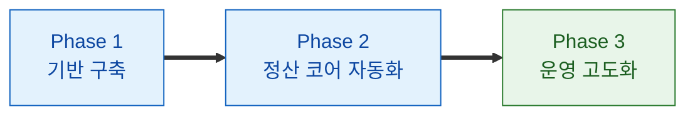

# 정산 시스템 구축 제안 (Why & Roadmap)
- 기준 문서: [[정산 시스템 구축 가이드]], [[정산 시스템 설계]], [[정산 시스템 역할별 할 일]]
- 목적: 전담 팀·시스템이 없는 현재 상태에서 정산 시스템을 구축해야 하는 이유와 단계별 로드맵 제시

## 1. 현재 상태 (AS-IS)
| 영역 | 현재 상태 | 문제 |
| --- | --- | --- |
| 조직 | 정산 전담 팀·담당 시스템 부재 | 책임 소재 불명확, 담당자 개인 의존 |
| 집계 | 수동 집계 (엑셀·수기 쿼리) — SNO 팀이 회차당 10일 소요 | 휴먼 에러 상시 노출, 정산 주기 대부분을 정산 작업 자체에 소진 |
| 업무 강도 | 정산 기간 중 상시적 초과 근무(야간 근무 포함) 발생 | 초과 근무 비용 발생, 피로 누적에 따른 오류 위험 증가 |
| 검증 | 체계적 대사 절차 없음 | 누락·중복·금액 오류를 사후에야 인지 |
| 지급 | 수동 이체 처리 | 중복 이체·지급 지연 리스크 |
| 추적 | 계산 근거 미보존 | 파트너 문의·감사 대응 불가 |
| 확장 | 거래량·파트너 수 증가에 선형으로 인력 투입 필요 | 성장할수록 병목 심화 |

## 2. 만들어야 하는 이유
### 2.1 리스크 관점 — 사고는 시점의 문제
| 리스크 | 내용 | 발생 시 영향 |
| --- | --- | --- |
| 금전 사고 | 수동 처리 중 과지급·미지급·중복 이체 | 직접적 금전 손실, 회수 비용 |
| 신뢰 훼손 | 정산 오류·지연의 반복 | 파트너 이탈, 입점 유치 경쟁력 하락 |
| 법적·세무 | 원천징수 누락, 증빙 미비, 정산 조항 위반 | 가산세, 분쟁, 감사 지적 |
| 키맨 리스크 | 담당자 부재 시 정산 업무 중단 | 지급 지연이 곧 서비스 장애 |
| 조직 리스크 | 회차당 10일의 고강도 집중 근무가 반복 — 지속 가능성이 낮은 운영 구조 | 핵심 인력 이탈 위험, 숙련자 이탈 시 정산 품질·업무 연속성 급락 |
- 핵심: 수동 정산의 오류율은 거래량에 비례하여 증가 — 규모가 커진 뒤에는 사고가 난 뒤에야 구축하게 됨

### 2.2 비즈니스 관점 — 성장의 전제 조건
| 항목 | 내용 |
| --- | --- |
| 확장성 | 파트너 수·거래량 증가를 인력 증원 없이 흡수 — 시스템 없이는 성장이 곧 비용 |
| 파트너 경험 | 정확하고 예측 가능한 정산은 입점·유지의 핵심 경쟁력 (정산 지연은 이탈 1순위 사유) |
| 운영 비용 | 반복 수동 업무(집계·검증·이체·문의 대응)를 자동화하여 운영 인력을 고부가 업무로 전환 |
| 인력 회수 | SNO 팀이 회차당 10일을 정산에 투입 중 — 자동화 시 해당 리소스를 본연 업무(운영 개선·파트너 관리)로 회수 |
| 인건비 효율 | 회차마다 반복되는 초과 근무 비용을 구조적으로 제거 — 자동화 투자 대비 회수 가능한 직접 비용 |
| 조직 지속성 | 정규 근무 시간 내 처리 가능한 운영 구조로 전환 — 핵심 인력 유지(리텐션)와 업무 연속성 확보 |
| 의사결정 | 수수료 수익·정산 규모 데이터의 실시간 가시성 확보 — 요율 정책·사업 판단의 근거 |

### 2.3 지금 시작해야 하는 이유
- 정산 시스템은 사고 후 구축 시 비용이 기하급수로 증가함 (과거 데이터 복원 + 신뢰 회복 + 병행 운영)
- 원장·감사 로그는 사후 소급 구축이 불가능 — 초기부터 쌓아야 하는 자산
- 거래 규모가 작은 지금이 정책 확정·검증(수동 대조 병행)에 드는 비용이 가장 낮은 시점

## 3. 구축 로드맵 (Phase 1~3)

- 다이어그램 범례
  - 파랑: 진행 단계
  - 초록: 최종 단계
- 구축 가이드의 Phase 1~7을 실행 단위 3개로 재편 (가이드 1~2 → Phase 1, 가이드 3~5 → Phase 2, 가이드 6~7 → Phase 3)

### 3.1 Phase 1 — 기반 구축 (정책·데이터)
| 항목 | 내용 |
| --- | --- |
| 목표 | 정산 정책 확정 및 신뢰 가능한 원천 데이터 확보 |
| 범위 | 정산 정책서(기준일·주기·수수료·반올림), Outbox 기반 이벤트 파이프라인, 정산 원천 적재 |
| 산출물 | 정산 정책서, SettlementSource 테이블·수집기, 원천 건수 대사 배치 |
| 성공 기준 | 전체 거래가 누락 없이 원천으로 적재됨 (주문 DB 대비 건수 일치율 100%) |
| 병행 운영 | 정산 자체는 기존 수동 방식 유지 — 데이터만 먼저 쌓기 시작 |
- 원칙: 정책 확정 없이 개발 착수 금지, 원장·감사 로그는 이 단계부터 포함

### 3.2 Phase 2 — 정산 코어 자동화 (계산·대사·지급)
| 항목 | 내용 |
| --- | --- |
| 목표 | 집계부터 지급까지 자동화된 정산 사이클 완성 |
| 범위 | 건별 계산·회차 집계 배치, PG 대사, 상태 머신·확정, 이체 연동(멱등키) |
| 산출물 | 정산 배치, 대사 모듈, 지급 모듈, 이중 실행 방어 계층 |
| 성공 기준 | 시스템 정산 결과 = 수동 정산 결과 (N회차 연속 100% 일치 후 수동 종료) |
| 병행 운영 | 시스템·수동 정산 병행하여 결과 대조 — 일치 검증 완료 시점에 시스템으로 전환 |
- 원칙: 검증 완료 전 실지급 자동화 금지 — 지급 실행은 마지막에 전환

### 3.3 Phase 3 — 운영 고도화 (가시성·확장)
| 항목 | 내용 |
| --- | --- |
| 목표 | 파트너·운영자 셀프서비스 및 세무·회계 연동 완성 |
| 범위 | 파트너 정산서·조회 화면, 어드민(수동 처리·조정 승인), 모니터링, 세금계산서·원천세 연동 |
| 산출물 | 파트너 화면, 어드민, 모니터링 대시보드, 세무 신고 자료 자동 생성 |
| 성공 기준 | 정산 문의 건수 감소, 회차당 운영 수동 개입 최소화, 세무 자료 자동 산출 |
| 병행 운영 | 없음 — 완전 시스템 운영 체제 |

## 4. 팀 구성 제안
| 시기 | 형태 | 구성 (예시) |
| --- | --- | --- |
| Phase 1~2 | TF (겸직) | 백엔드 2, 프론트 1, PM 0.5, 데이터 0.5 + 재무·법무 협의체 |
| Phase 3 | 전담 운영 체계 | 백엔드 담당 지정 + 정산 운영 담당 1 (개발팀과 분리된 운영 책임) |
- 전담 팀을 먼저 만드는 것이 아니라, TF로 시작하여 시스템과 함께 운영 체계를 성숙시키는 방식 권장
- 역할별 상세 업무는 [[정산 시스템 역할별 할 일]] 참조

## 5. 성공 지표 (구축 전후 비교)
| 지표 | AS-IS (수동) | TO-BE (시스템) |
| --- | --- | --- |
| 회차당 정산 처리 시간 | SNO 팀 10일 소요 (상시 초과 근무 수반) | 배치 자동 실행 + 검토·승인만 수행 (1~2일 이내 목표) |
| 초과 근무 | 정산 기간 중 상시 발생 | 정규 근무 시간 내 처리 — 야간 처리는 배치가 수행 |
| 금액 오류 | 사후 인지 (파트너 문의로 발견) | 대사 단계에서 사전 차단 |
| 지급 사고 | 중복·누락 가능 | 멱등키·다층 방어로 원천 차단 |
| 문의 대응 | 건별 수기 확인 | 파트너 셀프 조회 + 근거 드릴다운 |
| 감사 대응 | 근거 재구성 필요 | 원장·스냅샷 기반 즉시 소명 |
