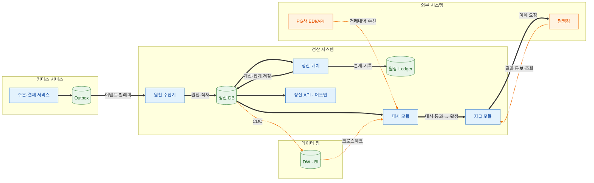
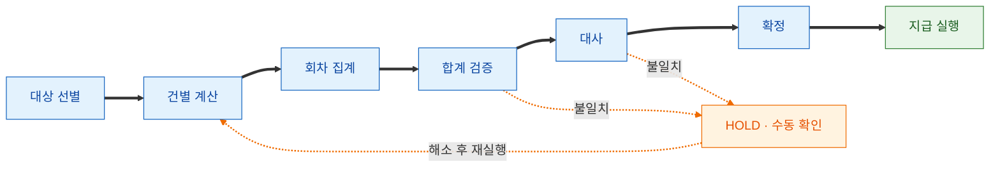
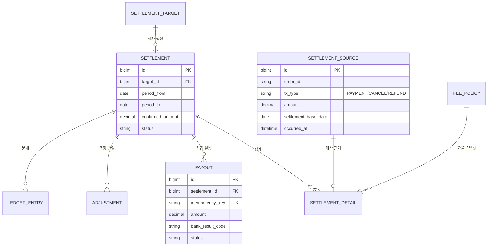
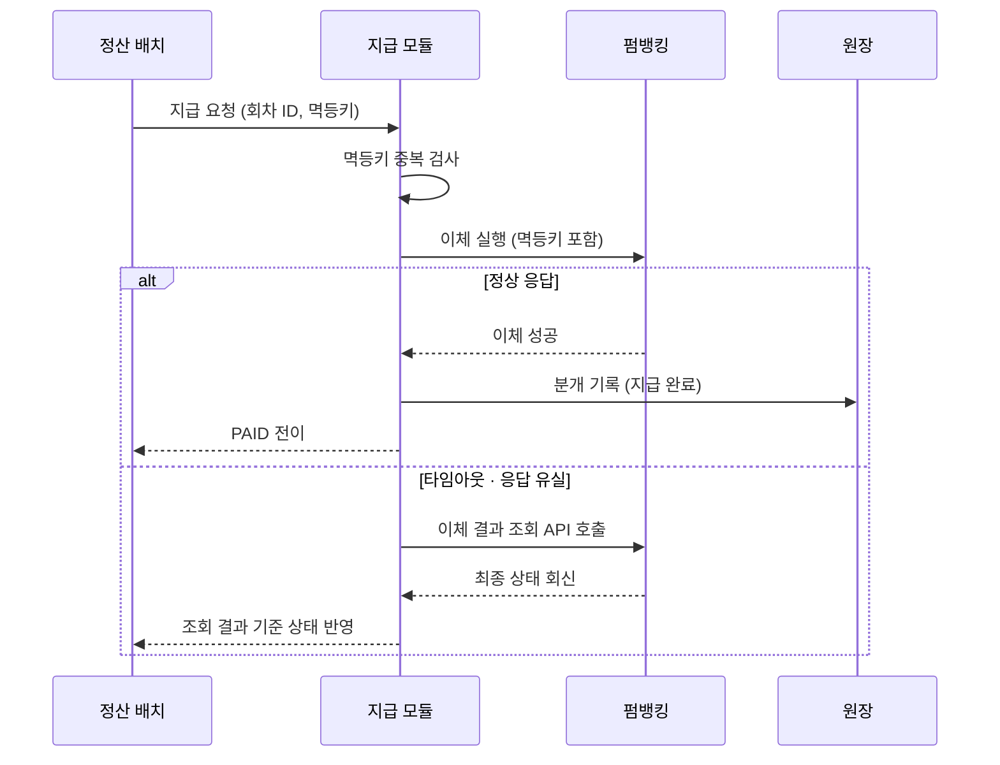

# 정산 시스템 설계 (System Design)
- 기준 문서: [[정산 시스템 구축 가이드]], [[정산 시스템 역할별 할 일]]
- 관점: 백엔드 엔지니어 — 전체 아키텍처, 배치 파이프라인, 데이터 모델, 지급 처리 설계

## 1. 설계 목표와 전제
| 항목 | 내용 |
| --- | --- |
| 최우선 가치 | 정합성 > 실시간성 — 확정 금액은 배치로 산출, 실시간 값은 예상치로만 제공 |
| 처리 방식 | 배치 기반 확정 + 이벤트 기반 원천 수집 (하이브리드) |
| 정합성 장치 | 원천 불변(Append-only), 요율 스냅샷, 복식부기 원장, 다단계 대사 |
| 멱등성 | 배치 재실행·이체 요청 모두 멱등 보장 (재실행 시 결과 동일) |
| 격리 | 정산 DB를 운영(주문/결제) DB와 분리 — 배치 부하·장애 격리 |
| 추적성 | 모든 금액은 원천 거래까지 역추적 가능해야 함 |

## 2. 전체 아키텍처

- 다이어그램 범례
  - 파랑: 애플리케이션 컴포넌트, 초록: 저장소, 주황: 외부 시스템
  - 굵은 검정 실선: 내부 동기 흐름, 주황 점선: 외부 연동·비동기 흐름
- 핵심 설계 포인트
  - Outbox 패턴: 결제 트랜잭션과 이벤트 발행의 원자성 보장 — 이벤트 유실 시 원천 누락으로 직결되므로 필수
  - 원천 수집기: 이벤트 소비 시 멱등 처리 (중복 이벤트는 원천 유니크 키로 차단)
  - 정산 DB 분리: 배치 대량 조회가 운영 트래픽에 영향 주지 않도록 물리 분리
  - DW 크로스체크: 데이터 팀 독립 집계와 상호 대사하여 이중 검증 ([[정산 시스템 역할별 할 일]] 4.2 참조)

## 3. 컴포넌트별 책임
| 컴포넌트 | 책임 | 비고 |
| --- | --- | --- |
| 원천 수집기 | 결제/취소/환불 이벤트 소비, SettlementSource 불변 적재 | Kafka Consumer, 멱등 처리 |
| 정산 배치 | 대상 선별 → 건별 계산 → 집계 → 검증 | Spring Batch, 회차 단위 실행 |
| 대사 모듈 | PG 거래내역 수신·파싱, 자동 매칭, 불일치 큐 관리 | 확정의 선행 조건 |
| 지급 모듈 | 이체 실행, 멱등키 관리, 실패 재처리 | 펌뱅킹 연동 |
| 원장 | 복식부기 분개 기록 (Append-only) | 잔액 대사의 기준 |
| 정산 API · 어드민 | 파트너 조회, 운영 처리, 조정 승인 워크플로 | 권한 분리 (Maker-Checker) |

## 4. 정산 배치 파이프라인

- 다이어그램 범례
  - 굵은 검정 실선: 정상 흐름, 주황 점선: 예외 흐름 (검증·대사 불일치 시 HOLD 후 해소 시점부터 재실행)
- 단계별 설계 원칙
  - 대상 선별: 마감 시각(Cut-off) 기준 스냅샷 — 이후 유입 원천은 다음 회차로 귀속
  - 건별 계산: 요율은 거래 시점 스냅샷 사용, 계산 근거를 SettlementDetail에 함께 저장
  - 집계·검증: 건별 합 = 집계값 검증을 배치 단계로 내장, 불일치 시 확정 차단
  - 멱등성: 회차 단위 재실행 시 기존 산출물 삭제 후 재생성, 단계별 체크포인트로 부분 재실행 지원
  - 이중 실행 방지: 분산 락으로 동일 회차 동시 실행 차단

## 5. 데이터 모델 (ERD)

- 설계 원칙
  - SettlementSource: 불변 — 취소/환불은 마이너스 원천 레코드로 추가, UPDATE 금지
  - SettlementDetail: 적용 요율·계산 입력값 스냅샷 보관 (역추적 근거)
  - Payout: 이체 요청당 멱등키 유니크 제약으로 중복 이체 원천 차단
  - LedgerEntry: 차변/대변 쌍 기록, Append-only — 임의 시점 잔액 산출 가능

## 6. 지급 처리 시퀀스

- 설계 원칙
  - 응답 유실 시 임의 재시도 금지 — 반드시 결과 조회로 최종 상태 확인 후 처리 (중복 이체 방지)
  - 부분 실패: 실패 건만 PAY_FAILED로 격리, 성공 건 지급은 유지
  - 이체 한도 초과 시 분할 이체 정책 적용

## 7. 기술 스택
| 영역 | 선택 | 근거 |
| --- | --- | --- |
| 애플리케이션 | Spring Boot, Spring Batch | 팀 주력 스택, 청크 처리·재시작 지원 |
| 정산 DB | MySQL (운영 DB와 분리) | 트랜잭션 정합성, 금액은 DECIMAL 타입 |
| 이벤트 | Kafka + Outbox Relay (Debezium 등) | 결제 이벤트 유실 방지, 순서 보장 |
| 분산 락 | Redis (ShedLock 등) | 배치 이중 실행 방지 |
| 스케줄러 | Spring Batch + 스케줄링 도구 (Jenkins/Airflow) | 재실행·모니터링 용이성 |
| 모니터링 | 배치 실패·대사 불일치·지급 실패율 알림 | Slack 알림 연동 |

## 8. 모듈 구성
| 모듈 | 역할 |
| --- | --- |
| settlement-domain | 엔티티, 계산 로직, 정책 (외부 의존성 없음 — 단위 테스트 집중 영역) |
| settlement-batch | 정산 배치 Job/Step 구성 |
| settlement-api | 파트너·어드민 API |
| settlement-worker | 이벤트 소비 (원천 수집기), 지급 실행 |
| settlement-infra | DB, Kafka, 뱅킹·PG 연동 어댑터 |
- 원칙: 수수료·공제 계산 로직은 settlement-domain 단일 소유 — 배치/API 어디서든 동일 로직 사용

## 9. 확장성·장애 대응
| 시나리오 | 대응 설계 |
| --- | --- |
| 거래량 증가로 배치 지연 | 정산 대상 기준 파티셔닝 병렬 처리 (Spring Batch Partitioning) |
| 배치 중 실패 | 단계별 체크포인트에서 재시작, 회차 단위 멱등 재실행 |
| 이벤트 유실 의심 | 일 단위 원천 건수 대사 (주문 DB count vs 원천 count) 배치로 탐지 |
| PG 파일 미수신 | 대사 단계 진입 차단, 수신 지연 알림 후 수동 트리거 |
| 뱅킹 장애 | 지급만 보류(CONFIRMED 유지), 복구 후 재개 — 확정과 지급의 분리 설계 덕분에 가능 |
| 정산 DB 장애 | 원천은 Kafka에 보존되므로 복구 후 재소비로 재구축 가능 |
